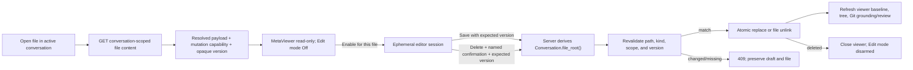

# Add safe per-file editing and deletion to the file viewer

## Observed journey

- A user can browse the active conversation’s file tree and open a text file or image in the shared file viewer, but the viewer is read-only.
- The requested journey is: open one file → explicitly enable **Edit mode** → edit and save text content and/or delete that open file.
- Edit mode must be off by default and scoped to the current open-file session so switching files, closing the viewer, switching conversations, or reloading cannot leave destructive controls armed.
- Product decisions resolved for this task:
  - edit mode is per-file-session, not a conversation or persisted preference;
  - deletion is files-only (no empty or recursive directory deletion);
  - Delete is exposed only in the open viewer, never in the file-tree context menu.

## Verified findings

- `FileTree` opens only server-classified text and image entries through `FileExplorerProvider` / the URL-backed prose viewer slot. Opaque files and directories do not open in this viewer (`ui/src/components/FileExplorer/FileTree.tsx`, `fileExplorerTypes.ts`, `ViewerSlotContext.tsx`).
- `FileViewer` loads `/api/files/read`, builds a resolved `MetaViewerPayload`, and delegates all rendered-file chrome/body behavior to `MetaViewer` (`ui/src/components/FileViewer.tsx`, `ui/src/components/viewer/MetaViewer.tsx`, `metaViewerTypes.ts`).
- The current code/text body is a read-only `@pierre/diffs` `CodeView`; Phoenix is pinned to `@pierre/diffs` 1.2.0 and has no editable file component. Editing therefore needs a dedicated text-editor body rather than making the read-only renderer content-editable or depending on an unstable Pierre editor API.
- `FileViewer` is mounted in narrow-desktop, wide split-pane, and mobile branches in `ConversationPage`; the active conversation id is available at each mount but is not currently passed to the viewer.
- `/api/files/read` and `/api/files/list` are intentionally read-oriented: their allowlist spans every conversation preview root plus globally discovered skill trees. Reusing that global allowlist as write authority would let one browser request mutate another conversation’s checkout or installed skills merely because those paths are readable (`canonicalize_within_roots*`, `read_root_allowlist`, and `read_file` in `crates/phoenix-ide/src/api/handlers.rs`).
- The server already owns the authoritative mutable root: `Conversation::file_root()` selects the worktree path when present and otherwise the conversation cwd. `DesktopLayout` independently withholds `effectiveCwd` for archived/unconfirmed conversations, but backend mutation must re-check authority rather than trusting UI gating.
- `FileTree` refreshes on a manual/periodic key and `FileExplorerPanel` refreshes Git grounding separately. A successful mutation needs an immediate typed invalidation path so deletion does not remain visible for up to ten seconds and save/delete Git status is not stale.
- Existing backend tests cover read traversal, escaped symlinks, binary classification, and size limits; existing UI tests cover typed text/image payloads, tree refresh races, responsive viewer branches, and viewer chrome. `ConfirmDialog` / `ViewerShell` provide established destructive and nested-confirmation patterns.
- The prose viewer slot is URL-persisted, but edit mode is an ephemeral capability state, not viewer identity. Putting it in URL params or localStorage would violate the selected safety behavior.

## Inferences and resolved boundaries

- Text editing applies to UTF-8 files returned by the server’s text classification. Image payloads can be deleted under the same gate but do not get a text editor. Opaque files cannot be deleted in this slice because the selected viewer-only UX cannot open them.
- File creation, rename/move, directory deletion, binary editing, permission editing, and bulk operations are explicit non-goals.
- A simple full-height, monospaced source editor is sufficient for the first slice; syntax-highlighted editing is not an acceptance requirement. It must preserve the controlled text value, support normal keyboard editing (including indentation/tab behavior), and remain responsive within the existing file-size boundary.
- Edit mode and its draft are in-memory only. A dirty draft must not be silently discarded by the viewer’s own close/disarm/file-replacement controls: require an explicit discard decision, and install a native `beforeunload` warning while dirty. Confirm before emitting a URL slot transition so the URL remains the viewer source of truth. No draft or armed state is restored after unmount/reload.
- Save/delete must use optimistic concurrency. A file can change while open because an agent, terminal, Git operation, or another browser edits the same checkout. The server must compare an opaque content version observed by the reader and return `409 Conflict` rather than overwriting/deleting newer bytes. The UI preserves the draft on conflict and offers an explicit reload-latest recovery; there is no force-overwrite action in this slice.
- Line annotations are unavailable while the source editor body is armed, but existing review notes are never silently cleared or rewritten by save/delete. Disarming returns to the normal annotatable rendering of the saved/reloaded content.

## Interaction map

- Persistence/recovery: no database row, URL param, localStorage value, or reconnect state stores the edit-mode flag or draft. The durable outcome is only the filesystem mutation.
- Cancellation: canceling delete, discard confirmation, or reload-latest performs no mutation; a failed/conflicting request leaves the draft and edit mode intact.
- Refresh: save updates the viewer’s canonical baseline/version; delete closes the now-invalid viewer. Both immediately invalidate visible file-tree listings and Git/review grounding through a typed React owner rather than a loose global event.

## Proposed scope

### 1. Specify the safety and lifecycle contract

Extend `specs/file-explorer/requirements.md` and `executive.md` with timeless requirements covering:

- off-by-default, per-open-file edit-mode arming and automatic disarming;
- UTF-8 source editing and explicit save;
- file-only, viewer-only deletion with a second path-naming confirmation;
- conversation-derived mutation authority and traversal/symlink/directory rejection;
- optimistic concurrency and conflict recovery;
- dirty-draft exit protection and immediate post-mutation refresh;
- read-only behavior for unsupported/ineligible payloads.

Add a focused `specs/file-explorer/file-editing.allium` because the edit lifecycle has meaningful `read_only → armed_clean → armed_dirty → saving/conflict/deleting` transitions, ordering constraints, and partial-failure behavior. Keep edit state outside the viewer-slot identity; model user intent as being held before a slot-changing event is emitted when discard confirmation is required. Do not extend the legacy `design.md`. Run the spec-authoring pre-flight and `allium check`.

### 2. Add conversation-scoped, versioned file-content APIs

Add typed routes conceptually equivalent to:

- `GET /api/conversations/:id/files/content?path=<relative-path>`
- `PUT /api/conversations/:id/files/content` with `{ path, content, expected_version }`
- `DELETE /api/conversations/:id/files/content` with `{ path, expected_version }`

The exact module split may use a focused `api/conversation_files.rs`; keep route registration in the existing API router and shared response types in the normal API type layer.

Backend invariants:

- The request carries a conversation id and **relative path only**. It never carries a client-authoritative root for mutation.
- Load the conversation, reject coordinator/no-filesystem and archived/ineligible scopes, derive `Conversation::file_root()`, canonicalize the root, and require the existing target to resolve as a strict descendant.
- Reject absolute paths, `..`, missing targets, directories, and symlink leaf targets. Re-check all authority on PUT/DELETE; a prior successful GET or UI capability is not authorization.
- GET retains the existing text/image classification, UTF-8 validation, and bounded-size behavior through shared helpers rather than creating a second drifting classifier. Its resolved payload carries a typed mutation capability: ordinary mutable files include an opaque SHA-256 version; ineligible/read-only targets carry a reason and cannot make the UI render an armed state.
- PUT accepts text only, enforces the existing maximum byte size on the submitted UTF-8 bytes, compares `expected_version` with current bytes immediately before writing, and returns `409 Conflict` on mismatch/missing replacement target.
- Replace via a temporary file in the same canonical directory plus atomic rename/replace; preserve the original file permissions (including executable bits), clean up failed temporaries, and never expose a partially written file.
- DELETE accepts files only, compares the same expected version immediately before unlink, and returns conflict rather than deleting a changed file.
- Successful PUT returns the new opaque version without echoing a second copy of content; successful DELETE returns no duplicate payload.
- Do not mutate Git index/refs, database state, directories, global skill files, another conversation’s root, or paths reachable only through read-root widening.

Keep `/api/files/read` for existing task/skill and other read-only callers; refactor common bounded read/classification logic if needed so the new conversation-scoped GET does not diverge.

### 3. Add an explicitly armed editor body to the resolved viewer

Thread `conversationId` through all `ConversationPage` `FileViewer` mounts and use the conversation-scoped content API for conversation files.

Make editability structurally explicit in `MetaViewerPayload`, for example as a discriminated `read_only | mutable` file-actions capability rather than optional callbacks/booleans that can drift. Direct fixtures must choose a variant explicitly.

In `FileViewer` / `MetaViewer` (with a colocated `FileEditorBody.tsx` and CSS if appropriate):

- Render an inline `Edit mode: Off` control only for server-eligible open files.
- Enabling it affects only the current absolute path/component session. It is never written to the viewer URL or storage.
- For text payloads, replace rendered Markdown/code/text/HTML bodies with a controlled, full-height monospaced source editor. Do not expose annotation, rendered Markdown, or HTML preview controls while editing; retain existing notes without silently clearing them.
- Show clear armed state plus Save, Cancel/turn-off, and Delete actions. Save is disabled while clean or in flight. Prevent duplicate save/delete requests.
- On successful save, adopt the submitted text and returned version as the new clean baseline, refresh dependent surfaces, and remain armed-but-clean until the user turns edit mode off or leaves.
- On save conflict/failure, remain armed, preserve the exact draft, show an accessible error, and provide explicit reload-latest recovery. Reloading a dirty draft requires discard confirmation.
- For images, the same edit-mode gate exposes Delete but no text editor or Save action.
- Delete always requires an additional destructive dialog that names the file/path and says it cannot be undone. Cancel issues no request. Success closes the viewer and disarms; failure/conflict keeps the viewer open.
- Disarming/closing/replacing the current viewer while dirty requires Keep editing vs Discard changes. A dirty session also registers `beforeunload`; a clean/disabled session does not.
- Switching file identity or conversation after an allowed transition starts a fresh off state with no inherited draft/version.

Do not add Delete to `FileTreeContextMenu`.

### 4. Refresh all affected read models immediately

Introduce one typed file-mutation invalidation owner shared by the viewer and grounding/file-tree consumers. After save/delete:

- refresh the root and visible expanded directory that owns the path;
- refresh conversation Git status and review manifest/checkpoint-derived state where enabled;
- on delete, remove/close the active viewer before stale restoration can keep reopening the missing path;
- do not wait for `FileTree`’s jittered ten-second refresh loop.

Retain the existing abort/generation protections so a stale pre-mutation listing cannot overwrite the refreshed result.

## Regression and validation plan

### Backend tests

Cover both handlers and the shared resolver:

- in-root UTF-8 read returns text, typed mutable capability, and stable version;
- successful save changes bytes, returns a new version, preserves permissions, and never exposes a partial file;
- same-version delete removes exactly the file;
- stale-version save and delete return 409 and leave current bytes/path untouched;
- absolute/traversal, another conversation’s root, global skill root, escaped symlink, symlink leaf, directory, archived/coordinator, missing, binary-save, invalid UTF-8, and oversized content are rejected;
- a path swapped/changed between read and mutation is not overwritten/deleted;
- text/image classification remains in parity with `/api/files/read`.

### UI tests

Extend `FileViewer.test.tsx` / `MetaViewer` coverage and focused editor tests for:

- Edit mode starts off and is absent/disabled for read-only capability;
- enabling text editing, dirty tracking, save request shape, clean baseline/version update, and duplicate-submit prevention;
- conflict/error keeps the exact draft and reload-latest is explicit;
- dirty close/disarm/file replacement requires discard confirmation and clean close does not;
- file switch/conversation remount/reload starts disarmed;
- delete requires both the edit-mode gate and named confirmation, cancel is inert, success closes, and failure remains recoverable;
- image deletion is gated while image text editing is absent;
- save/delete trigger immediate tree/Git invalidation without stale request rollback;
- desktop pane, narrow desktop, and mobile overlay all receive the conversation id and expose the same safety behavior;
- keyboard/focus behavior keeps editing keystrokes out of file-viewer find/annotation and outer navigation scopes.

### User-journey QA

Add/update the MetaViewer QA fixture and run the real-browser journey at desktop and mobile widths:

1. Open a text file and verify no content can be changed and no Delete action is present while Edit mode is off.
2. Enable edit mode, change text, save, return to rendered view, and verify exact saved content plus immediate Git/tree grounding.
3. Create an external edit before Save and verify Phoenix preserves the draft while refusing to clobber newer content.
4. Cancel then confirm the named Delete dialog; verify cancel is inert, confirm closes the viewer, removes the tree entry, and shows Git deletion state.
5. Open another file and verify edit mode is off again.

Run targeted Rust/UI tests, `./dev.py codegen` only if generated types are actually introduced, the spec pre-flight, and `./dev.py check` with the lane summary captured on the first run.

## Risks and explicit non-goals

- **Security:** do not reuse the global read allowlist as mutation authority and do not trust the URL’s `root` parameter.
- **Lost updates:** never offer force overwrite/delete in this slice; a stale expected version is a visible conflict.
- **Partial writes:** direct truncate-and-write is unacceptable; replacement must be same-directory and atomic while retaining permissions.
- **State leakage:** no edit flag/draft in URL, localStorage, conversation persistence, SSE, or reconnect state.
- **Review data:** save/delete must not silently clear file review notes.
- **Non-goals:** create, rename/move, directory deletion, recursive deletion, tree-context-menu deletion, opaque/binary editing or deletion, permission editing, bulk operations, autosave, collaborative editing, file locking, syntax-highlighted editing, and Git stage/commit/revert actions.
