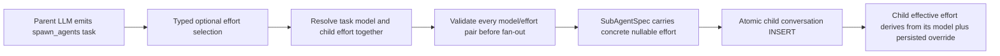

# Add an explicit model-default effort option to sub-agent spawning

## Observed journey

- A parent conversation has an explicit reasoning-effort override such as `xhigh`.
- The parent calls `spawn_agents` and selects an Explore, named-agent, or explicit task model that does not support that effort.
- The spawn request initially validates the model id, but child creation later fails with `Parent effort 'xhigh' is not supported by sub-agent model '…'`.
- This is reproducible from the current source path and does not require a UI interaction: `spawn_agents` has per-task `mode`, `model`, and `max_turns` fields, but no way to reset inherited effort for one child.

## Verified findings

- `SubAgentTask` and the `SpawnAgentsTool` JSON schema have no effort field (`phoenix-core::domain::sm_state::SubAgentTask`, `phoenix-tools::subagent::SpawnAgentsTool::input_schema`).
- A child conversation implicitly inherits the parent's nullable explicit effort in `Database::create_conversation_with_project`; the same `parent_id` query also inherits the WorkScope.
- Default Explore model routing in `ConversationRuntime::handle_spawn_agents_tool` already avoids one incompatibility case by falling back from the cheap model to the parent model when the cheap model cannot carry the inherited effort.
- Explicit task models and named-agent model defaults bypass that fallback. `RuntimeManager::handle_spawn_request` then rejects the inherited effort asynchronously with the reported error before creating the child.
- Spawn model ids are validated for the whole batch before any spawn request is sent, but effort compatibility is not. A later effort mismatch can therefore be discovered only after fan-out has begun.
- `REQ-LLM-004a` requires incompatible explicit effort to fail before provider I/O, `REQ-LLM-004b` defines reset as returning to model-native behavior, `REQ-LLM-004c` forbids a transient persisted model/stale-effort combination, and `REQ-LLM-004d` currently requires an omitted child selection to inherit only the parent's explicit override.
- The existing `conversations.effort` column already represents the resolved child state: `NULL` means model-native default and a typed `ModelEffort` means an explicit override. No schema migration is needed.

## Inferences and resolved semantics

The requested `"default"` value is an explicit reset, not another `ModelEffort` level. It must remain distinct from both omission and the existing explicit `"none"` level:

| Per-task `effort` input | Child explicit effort | Behavior |
|---|---:|---|
| omitted | parent's explicit override, if any | Preserve existing inheritance semantics |
| `"default"` | `NULL` | Resolve the selected child model's own native/default behavior |
| `"none"`, `"minimal"`, `"low"`, `"medium"`, `"high"`, `"xhigh"`, or `"max"` | selected typed level | Replace inheritance after capability validation |

This interpretation preserves backward compatibility for existing tool calls while giving the parent agent a deliberate escape hatch for heterogeneous sub-agent models.

## Interaction map

- Producer: the parent LLM, guided by the generated `spawn_agents` tool schema.
- Boundary: JSON tool input into canonical `SubAgentTask`, then resolved `SubAgentSpec`.
- Consumer: `RuntimeManager::handle_spawn_request` and the database child-conversation creation path.
- Persistence/recovery: the existing nullable effort column remains authoritative; runtime recreation already derives `effective_effort` from the persisted model plus nullable override.
- Cancellation/fan-in are unchanged.

## Proposed scope

### 1. Specify the three-way spawn effort contract

- Extend the timeless sub-agent and LLM requirements so omission means inherit the parent's explicit override, `"default"` means do not inherit an override, and an explicit level replaces inheritance only when supported by the resolved child model.
- Extend `subagents.allium` value types and spawn-resolution rules with the optional input selection and concrete resolved child effort.
- Update the sub-agent executive summary/status to reflect the delivered tool contract.
- Run the spec-authoring pre-flight in `specs/AUTHORING.md`, including `allium check` and spec-shape validation.

Likely artifacts: `specs/subagents/requirements.md`, `specs/subagents/subagents.allium`, `specs/subagents/executive.md`, and `specs/llm/requirements.md`.

### 2. Add one canonical typed tool-input selection

- Add an optional per-task effort field whose JSON vocabulary is exactly `"default"` plus `ModelEffort`'s existing wire names.
- Represent the supplied value as a typed sum such as model-default versus explicit `ModelEffort`; do not add `Default` to `ModelEffort`, because model-default is an omission/reset policy rather than a provider effort level.
- Reuse the canonical spawn input type in `phoenix-tools::subagent` validation rather than introducing another free-form or duplicated effort representation.
- Render `effort` as optional in `SpawnAgentsTool::input_schema`, with guidance that omission inherits the parent's explicit override and `"default"` uses the child model's native behavior. Derive explicit choices from `ModelEffort::ALL`/wire names so schema and deserialization cannot drift.

Likely symbols: `SubAgentTask`, a new typed spawn-effort selection near it, `SpawnAgentsTool::input_schema`, and the tool's validation parser.

### 3. Resolve and validate effort before fan-out

- In `ConversationRuntime::handle_spawn_agents_tool`, resolve the model and effort as one compatibility decision:
  - omitted effort resolves from the parent's explicit override;
  - `"default"` resolves to no explicit child override;
  - an explicit level resolves to that level.
- Use the resolved child effort—not unconditionally the parent's effort—when deciding whether the default cheap Explore model is compatible.
- Validate every resolved non-null effort against every resolved model, including explicit task models and named-agent model defaults, during the existing all-tasks preflight. Reject the whole call before sending any `SubAgentSpawnRequest` if a pair is incompatible.
- Carry the fully resolved `Option<ModelEffort>` on `SubAgentSpec`. At that layer `None` has one meaning only: the child follows its selected model's native default.
- Keep a spawn-manager defense against live capability drift, but validate the concrete spec effort rather than re-reading and unconditionally applying the parent effort.

Likely symbols: `ConversationRuntime::handle_spawn_agents_tool`, `SubAgentSpec`, and `RuntimeManager::handle_spawn_request`.

### 4. Persist the resolved effort atomically at child creation

- Add a typed child-conversation creation input/path that distinguishes inherited effort from a concrete resolved nullable child effort.
- Write the resolved child model and effort in the same initial `INSERT`, while retaining parent WorkScope/runtime-role inheritance.
- Do not create with the stale inherited effort and clear it afterward; that would violate the atomic model/effort invariant and briefly persist an invalid pair.
- Avoid a generic `Option<Option<ModelEffort>>` or another ambiguous optional argument whose `None` could mean either inherit or reset.
- Keep the existing nullable `conversations.effort` column and effective-effort reconstruction; no migration or parallel persisted representation is needed.

Likely symbols: `Database::create_conversation_with_project` or a focused typed child-creation wrapper, and `RuntimeManager::handle_spawn_request`.

### 5. Regression coverage and validation

Add tests proving:

1. The schema exposes optional `effort` choices including `"default"` and all `ModelEffort` wire values, without making the field required.
2. Omission, `"default"`, and explicit `"none"` deserialize to three distinct meanings.
3. Omission retains a compatible parent explicit override and retains the existing default-model fallback behavior when necessary.
4. `effort: "default"` with an explicit or named-agent model that does not support the parent's `xhigh` succeeds, keeps that selected model, persists `effort = NULL`, and derives the child model's native/unsupported effective state.
5. A compatible explicit child level replaces the parent's override and is persisted on the child.
6. An incompatible explicit level or incompatible omitted inherited level is rejected during whole-batch preflight, before any child request is sent.
7. In a multi-task batch, an incompatible later task starts no earlier tasks.
8. Runtime recreation reads the same child model/effort state; no post-create repair is needed.
9. Relevant focused Rust tests, `allium check`, code formatting/lints, task validation, and `./dev.py check` pass.

## Owning invariant

Every spawned child begins life with one model and one compatible explicit-effort state, chosen before fan-out and persisted atomically. Omission inherits the parent's explicit choice; `"default"` explicitly declines inheritance; provider/model-native defaults are never serialized as fake `ModelEffort` values.

## Risks and non-goals

- **Risk:** changing omission to mean reset would silently alter existing callers. Preserve omission as inheritance and require the explicit `"default"` sentinel.
- **Risk:** `"none"` is an existing real effort level and must not be conflated with `"default"`/SQL `NULL`.
- **Risk:** adding a post-insert update would expose a transient invalid model/effort pair. The insert path must receive the resolved value.
- **Non-goal:** automatically choose effort based on task content, cost, or model family.
- **Non-goal:** add effort defaults to named-agent frontmatter.
- **Non-goal:** change provider request serialization, the conversation UI, fan-in, cancellation, timeout, or turn-budget behavior.
- **Non-goal:** migrate existing conversations; the existing nullable effort column already has the required durable meaning.
