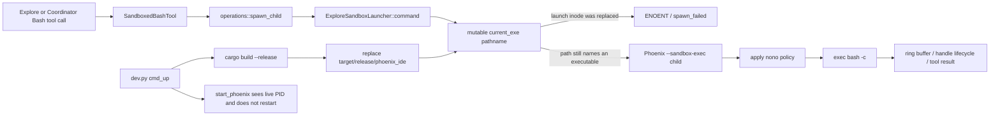

# Fix Explore Bash after the running Phoenix binary is replaced

## Observed journey

- In a top-level Explore conversation, invoking `bash(op="run", ...)` sometimes succeeds and sometimes fails before the command starts with:

  ```json
  {
    "error": "spawn_failed",
    "error_message": "failed to spawn bash child: No such file or directory (os error 2)"
  }
  ```

- The failure was reproduced repeatedly in the active Linux/WSL Phoenix process: two initial Bash calls and three independent follow-up calls all returned the same `spawn_failed`/`ENOENT` envelope. Read-only non-Bash tools continued to work.
- The same running process's `/proc/self/maps` identifies its executable as:

  ```text
  /home/omarchy/dev/phoenix-ide/target/release/phoenix_ide (deleted)
  ```

- A Phoenix restart restores Explore Bash until the running executable's pathname is replaced again, which makes the behavior appear intermittent to the user.

## Verified findings

- `BashTool` Direct mode launches `Command::new("bash")`, but `SandboxedBashTool` used by Explore and Coordinator does not. `spawn_child` delegates sandboxed runs to `ExploreSandboxLauncher::command` in `crates/phoenix-tools/src/bash/sandbox.rs`.
- `ExploreSandboxLauncher::command` resolves `std::env::current_exe()` for every call, then attempts to spawn that path with `--sandbox-exec`. The child applies `nono` and only then execs `bash -c`.
- On Linux, replacing or unlinking a running executable leaves the process alive on its original inode while `/proc/self/exe` reports the launch path with ` (deleted)`. `std::env::current_exe()` therefore produces a pathname that cannot be executed, and the outer `Command::spawn()` returns `ENOENT`. This exactly matches the reproduced failure.
- The `spawn_failed` message is misleading in this path: it says the Bash child failed, but Bash was never reached; Phoenix failed to spawn its sandbox-helper re-exec.
- `dev.py::cmd_up` always calls `build_rust(release=True)` before `start_phoenix`. If Phoenix is already healthy, `start_phoenix` prints `Phoenix server already running` and leaves that process alive. A relink can therefore replace `target/release/phoenix_ide` underneath the server without restarting it—the common local trigger for the deleted executable image.
- `dev.py::cmd_restart` also builds before stopping, but only leaves a short replacement-to-stop window; the runtime still must be correct during that window and under external/atomic binary replacement.
- Existing Bash unit tests use fresh on-disk binaries or only verify that a handle was minted. `tests/e2e/run.py::scenario_multi_tool` creates Direct-mode conversations, bypasses the sandbox helper, and counts Bash tool uses without asserting that their tool results succeeded. No test replaces the executable of a live server and then runs Explore Bash.

## Inferences and unknowns

- **Inference:** any operation that atomically replaces the server executable path can trigger the same Linux failure, not only `./dev.py up`. This is falsified if a live process whose launch inode is unlinked can still spawn the pathname returned by `current_exe()`; the active process and `ENOENT` reproduction show it cannot in this environment.
- **Inference:** the correct Linux helper identity is the live process image exposed by `/proc/self/exe`, not the mutable installation/build pathname. This also prevents a running old server from accidentally invoking a newly installed binary with a potentially incompatible internal `--sandbox-exec` protocol.
- macOS does not provide Linux `/proc/self/exe`; retain a platform-appropriate executable-path strategy there. Production deployment already stops the supervised process before atomically installing its replacement, so this task must not broaden into deployment redesign.
- No product preference is needed: Explore Bash is specified to remain available whenever the enforceable sandbox capability is exposed.

## Interaction map



- The failure is before handle commit, output capture, persistence, SSE, UI rendering, cancellation, or recovery. Those downstream systems are unaffected.
- Handle state remains in-memory and process-scoped as specified; this fix concerns launching the sandbox helper, not Bash-handle persistence across restart.

## Proposed scope

### Owning invariant

When Phoenix exposes sandboxed Bash, every admitted run must be able to launch the sandbox helper from the running Phoenix process image even if the filesystem pathname used to start that server has since been atomically replaced or unlinked. A command-level failure remains distinct from a tool-level helper-launch failure.

### Implementation

1. **Make sandbox helper re-exec stable on Linux.**
   - Update `ExploreSandboxLauncher` in `crates/phoenix-tools/src/bash/sandbox.rs` to execute the live process image through Linux `/proc/self/exe` rather than resolving a mutable/deleted pathname through `std::env::current_exe()`.
   - Keep the platform distinction explicit: use the live-image path on Linux and preserve a supported macOS fallback. Do not copy the Phoenix binary into a second persistent location or introduce a parallel helper artifact.
   - Ensure the child still receives the existing cleared/reduced environment, working directory, `--sandbox-exec -- <cmd>` protocol, scratch ownership, process-group setup, and `nono` application. Do not weaken fail-closed sandbox availability.
   - Make spawn diagnostics identify whether the failed process was the direct Bash child or the Explore sandbox launcher while retaining the stable `spawn_failed` error identifier.

2. **Remove the recurring local trigger.**
   - Change `dev.py::cmd_up` so a healthy already-running Phoenix that will be reused is not rebuilt underneath its live executable inode. Print an actionable message that Rust changes require `./dev.py restart`; continue starting/restarting Vite as needed.
   - Preserve build/start behavior when Phoenix is not running and preserve explicit restart/TLS-transition behavior. Do not turn `up` into an implicit backend restart.

3. **Align the Bash specification.**
   - Extend `specs/bash/requirements.md` under REQ-BASH-012/013 with the timeless availability rule: the sandbox helper must be launchable from the live server image after its original filesystem entry is replaced, and unavailable helper enforcement must fail closed rather than silently running unsandboxed.
   - Update `specs/bash/executive.md` implementation anchors/status notes. Allium currently excludes platform sandbox mechanics, so change it only if implementation reveals a lifecycle rule that belongs there.
   - Run the applicable checklist in `specs/AUTHORING.md`.

### Regression coverage

- Add a Linux regression that starts a real Phoenix server from a disposable executable path, atomically replaces/unlinks that path while the server remains alive, then drives a real **managed Explore-mode** mock conversation whose Bash tool call must complete successfully under `nono`. Assert the persisted tool result has `is_error == false` and expected command output/status—not merely that a Bash `tool_use` block exists.
- Keep the test isolated: use a disposable Git repository/worktree and database, restore or preserve a valid test binary pathname, and skip only when the platform sandbox is structurally unavailable.
- Add focused resolver/launcher coverage for Linux live-image selection and the macOS fallback where practical.
- Strengthen the existing Direct-mode E2E Bash scenario to assert Bash tool-result success so the two launch paths remain independently covered.
- Add `tests/devpy` coverage proving `cmd_up` skips `build_rust` when it reuses a healthy Phoenix, still builds when Phoenix is absent, and does not prevent Vite startup.

### Validation journey

1. Start Phoenix and verify an Explore Bash command succeeds.
2. Replace/relink the on-disk Phoenix executable while leaving the server process alive; confirm `/proc/<pid>/maps` marks the launch image deleted.
3. Run another Explore Bash command and verify it succeeds with normal ring-buffer output instead of `spawn_failed`.
4. Verify Direct-mode Bash still launches normally.
5. Run `./dev.py up` against an already-running healthy backend and verify it does not rebuild or replace the backend executable, while Vite remains/start becomes available.
6. Run focused Rust, E2E, dev.py, and spec-shape checks, then `./dev.py check` once with its lane summary captured.

## Risks

- `/proc/self/exe` is Linux-specific; platform selection must be compile-time explicit and must not regress macOS Explore Bash.
- A weak regression that executes a fresh binary cannot catch this bug. The test must unlink/replace the launch inode **after** the server starts and invoke the sandbox path through the live server.
- Re-executing the newly installed pathname would hide `ENOENT` but create a server/helper version-skew risk. The Linux fix must execute the current live image.
- Dev startup changes must distinguish reuse from an actual restart requirement; otherwise TLS-mode transitions could unexpectedly reuse stale configuration.

## Explicit non-goals

- No changes to Direct/Work Bash permissions, command safety checks, ring buffers, handle caps, cancellation, tombstone persistence, UI rendering, or tmux.
- No persistence of Bash handles across Phoenix restart.
- No weakening of the Explore `nono` filesystem, network, credential, or process-isolation policy.
- No redesign of systemd, launchd, or bare production deployment transactions.
