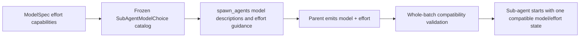

# Make sub-agent effort compatibility obvious before spawning

## Observed journey

- A parent agent selects `ollama/gpt-oss:120b` in `spawn_agents` and supplies an explicit effort such as `"medium"`.
- Phoenix rejects the whole call with an error such as `Effort 'medium' is not supported by sub-agent model 'ollama/gpt-oss:120b'`.
- The rejection is correct, but the tool definition contributed to the mistake: it presents one global effort enum beside a model catalog that does not say which effort values each model accepts.
- Omitting `effort` is not a universally safe workaround. By contract, omission inherits the parent conversation's explicit effort override, so a parent using `medium` can still produce the same incompatibility. `effort: "default"` is the always-valid way to request GPT-OSS's model-native behavior.

## Verified findings

- `SpawnAgentsTool::input_schema` exposes `"default"` plus every `ModelEffort` value in one global enum. Its description says to choose a supported value but gives the parent model no model-specific compatibility information.
- The model list in that same schema is built from `SubAgentModelChoice`, which contains only `id` and `description`; it drops the registry's typed `EffortCapabilities` when crossing into the tool catalog.
- `ollama_gpt_oss_model` has `EffortCapabilities::Unknown`. Phoenix therefore cannot advertise or send any explicit effort for that route, while model-native behavior remains valid.
- `ConversationRuntime::handle_spawn_agents_tool` already resolves model and effort together, rejects an incompatible pair before fan-out, aborts the whole batch, and explicitly recommends `effort: "default"`. `RuntimeManager::handle_spawn_request` retains a defense against capability drift.
- The normative sub-agent contract intentionally distinguishes omission, `"default"`, and explicit `"none"`: omission inherits, `"default"` clears inheritance, and `"none"` is a real provider effort level.
- A real `spawn_agents` invocation pinned to `ollama/gpt-oss:120b` succeeds with `effort: "default"`, confirming that the requested recovery path works.

## Failure model and owning invariant

The frozen model catalog and the effort enum are individually valid but incomplete as a pair. The producer sees every globally known effort value, while the consumer validates against model-specific capability metadata that was not threaded through the tool boundary.

**Invariant:** every model advertised by `spawn_agents` must carry enough typed capability information for the rendered tool definition to state its exact accepted explicit-effort choices. A model with unknown or unsupported effort capability must be advertised as model-default-only, with `effort: "default"` identified as the safe explicit selection. The runtime must continue rejecting rather than silently coercing incompatible requests.

## Proposed scope

### 1. Thread effort compatibility into the frozen sub-agent catalog

- Extend `SubAgentModelChoice` with a typed projection of the model's accepted explicit effort levels, populated by `ModelRegistry::subagent_model_catalog` from the same route-aware `EffortCapabilities` used by runtime validation.
- Preserve the LLM registry's distinction between unknown and unsupported capabilities. At the `spawn_agents` input boundary, both correctly advertise no accepted explicit levels because Phoenix cannot validate either one; do not guess support for GPT-OSS.
- Keep the catalog sorted and frozen per parent conversation so schema rendering and spawn-time decisions cannot drift during that conversation.
- Update test constructors and mocks to require deliberate capability metadata instead of silently fabricating all-level support.

Likely symbols: `SubAgentModelChoice`, `ModelRegistry::subagent_model_catalog`, `MockToolExecutor::with_subagent_models`, and the `ToolRegistryExecutor` catalog path.

### 2. Render actionable, model-specific tool guidance

- Update `SpawnAgentsTool::input_schema` so every available model description includes its legal effort contract:
  - GPT-OSS and other unknown/unsupported routes: `effort: "default" only` (or equivalent concise wording).
  - Effort-capable routes: `"default"` plus the exact supported explicit levels.
- Make the `effort` field description prominent and unambiguous: for a model marked model-default-only, set `effort` to `"default"`; do not merely omit it when the parent may have an explicit override, because omission inherits.
- Keep the global enum as the vocabulary of possible values unless provider-compatible schema constraints can express the model/effort dependency without duplicating each task shape. Do not add brittle conditional/combinator schema machinery merely to replace clear typed guidance; Anthropic has schema-combinator restrictions and `model` can also resolve through mode or named-agent defaults.
- Do not remove effort control globally. Supported models need explicit effort selection, and `"default"` must remain distinct from the real `"none"` level.

Likely symbol: `SpawnAgentsTool::input_schema` and its schema tests.

### 3. Keep validation fail-closed and improve any remaining error ambiguity

- Preserve whole-batch preflight in `ConversationRuntime::handle_spawn_agents_tool`; never silently drop or coerce an explicit effort.
- Use the frozen catalog capability projection where appropriate so the advertised choices and preflight share one conversation snapshot, while retaining the live registry defense before persistence/provider I/O.
- Ensure errors for both an explicitly incompatible level and an inherited incompatible parent level name the selected model and direct the parent to set `effort: "default"` explicitly.
- Preserve atomic persistence of the resolved nullable child effort and all existing fan-out, cancellation, timeout, mode, and cwd behavior.

### 4. Update the normative contract

- Refine `REQ-SA-011` so the frozen model catalog advertises legal explicit-effort choices and model-default-only models identify `"default"` as the safe selection; state that omission can inherit an incompatible parent override.
- Extend `SubAgentModelChoice` and `SpawnModelCatalogFrozen` in `subagents.allium` with the capability projection and rendered-guidance obligation.
- Refresh the matching `specs/subagents/executive.md` current-reality/status text.
- Keep timeless artifacts free of task references and run the `specs/AUTHORING.md` pre-flight, including `allium check`.

## Acceptance evidence

1. A schema test with `ollama/gpt-oss:120b` proves its model entry says to use `effort: "default"` and does not imply that `medium` or another explicit level is accepted.
2. Schema tests for supported Anthropic/OpenAI models list exactly the levels in their registry capability metadata, not the global superset.
3. The effort field guidance states that omission inherits the parent override and that model-default-only choices require an explicit `"default"` when inheritance may be incompatible.
4. Registry tests prove supported, unknown, and unsupported capability states project deterministically into the frozen sub-agent catalog without guessing.
5. GPT-OSS plus `effort: "default"` resolves to `explicit_effort = None` and successfully reaches fan-out/child creation.
6. GPT-OSS plus `effort: "medium"`, and GPT-OSS with omitted effort under a parent carrying `medium`, are rejected before any child in the batch starts; both errors recommend setting `effort: "default"`.
7. A compatible explicit level for a supporting model still replaces inheritance and starts normally.
8. Focused `phoenix-tools`, `phoenix-llm`, and `phoenix-ide` tests, Allium validation, formatting/lints, and `./dev.py check` pass.

## Risks and non-goals

- **Risk:** changing omission to mean model default would silently break the established inheritance contract. Keep omission as inheritance.
- **Risk:** treating unknown GPT-OSS capability as known support would allow unverified provider parameters. Keep it model-default-only unless authoritative route metadata is added separately.
- **Risk:** hand-written compatibility prose can drift. Generate model annotations from the typed frozen catalog and assert exact schema output.
- **Non-goal:** remove the effort field, auto-select task effort, change provider wire serialization, or silently retry a rejected spawn with a different effort.
- **Non-goal:** change GPT-OSS discovery, GPU residency, context sizing, fan-in, cancellation, or sub-agent budgets.
